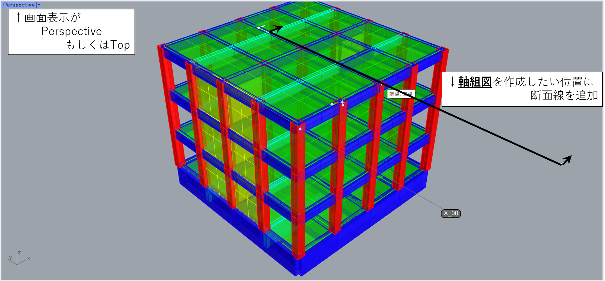
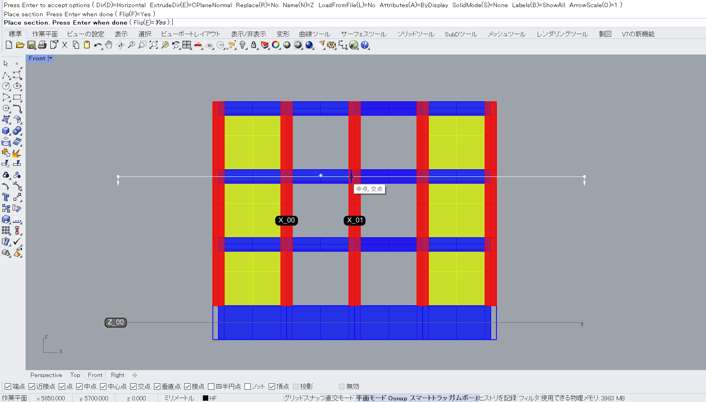
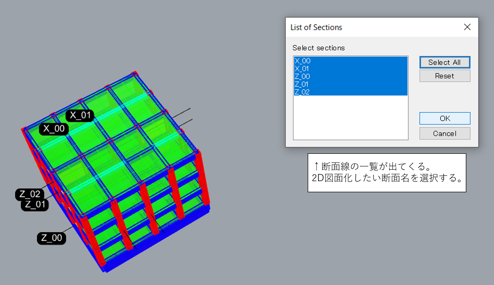
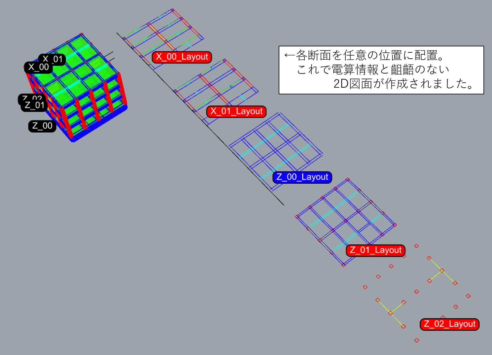

## モチベーション

日本の建築構造系の共有フォーマットである [ST-Bridge(STB ファイル)](https://www.building-smart.or.jp/meeting/buildall/structural-design/) ですが，正直なところ使用機会がありませんでした。
というのも最近まで BIM ソフトも普及しておらず，一貫構造計算プログラムでしか使用されていません。
その一貫構造計算プログラムにおいても相互でファイルをやり取りする必要もないため，長年 STB ファイルは宙ぶらりんの状態でした。

[上図は Building Smart Japan より](https://www.building-smart.or.jp/meeting/buildall/structural-design/)

昨今は徐々に BIM ソフトも普及しつつあり STB ファイルを使用して構造モデルを BIM ソフトに取り込み，図面など作成するような段階まで行きつつあります。
ただソフト価格が高額であるため，中小零細の建築事務所まで普及するのはまだ先になりそうです。

そんなときに現れたのが，STB ファイルを Grasshopper 上で読み込むコンポーネント[「HoaryFox」](https://www.food4rhino.com/app/hoaryfox)。
これを利用して打ち合わせ用に建物モデルをビジュアル化したり，計算書内に建物説明用のモデルを挿入したりしていました。
あるとき建物断面情報を持った STB ファイルを CAD ソフトである「Rhinoceros」で読み込めているのであれば，それをもとに構造図を手軽に書けるのでは？と気付き，様々試行錯誤しました。

以下はその記録です。

---

## 必要なプラグイン

必要なプラグインは以下の 2 つとなります。
特段特殊なものではないので，各々インストールしてもらえればと思います。

- [HoaryFox (Grasshopper コンポーネント)](https://www.food4rhino.com/app/hoaryfox)
- [SECTIONTOOLS FOR RHINO (Rhinoceros コンポーネント)](https://www.food4rhino.com/app/sectiontools-rhino)

## 「HoaryFox」による解析モデルの取り込み

### 1. 解析モデルの読み込み

基本的には HoaryFox の公式チュートリアル [Show ST-Bridge model](https://hiron.dev/HoaryFox/docs/Usage/ShowSTBModel) の項目を参照して，解析モデルを Grasshopper に取り込みます。

### 2. 断面を Rhino 側に Bake

読み込んだモデルを Rhino 側に Bake します。そのまままるごと Bake しても問題ありませんが，柱・梁・間柱・小梁などの部材種別ごとにレイヤ分けして Bake すると，後の修正作業が楽になります。

## 「SECTIONTOOLS FOR RHINO」 による断面作成

### 1. 断面線の作成

コマンド：stCreate と入力するか，ツールバーの　 Section Tools → create で断面を切る位置を指定します。コマンドが起動すると，いくつかオプションが出てきます。

- Dir : 表示されている画面の水平もしくは垂直軸に断面基準線を置くか設定できます。画面表示によって動きが異なり，Top もしくは Perspective では建物 X/Y 通りの断面が作成でき，Front もしくは Right では建物伏図・見上げ図が作成出来ます。

- ExtrudeDir : 断面線で切った Brep を押し出す事ができます。通常は 0 です。
- Replace : 断面線を設定した位置に既存の断面線が存在する場合，置き換える事ができます。
- Name : 断面線の頭文字を設定出来ます。「X」と設定すれば，X00, X01,X02,,,と命名されます。
- LoadFromFile : 自作したテキストファイルを読み込み，自動で断面線を構築することが出来ます。
- Attributes : 作成した断面の属性を指定します。切断されたオブジェクトの属性とするか，ディスプレイに表示されている属性と設定できます。
- SoliMode : 3D 上の切断したオブジェクトをソリッド化し切断面をサーフェス化するか，ハッチで埋めるか指定できます。
- Labels : 断面線位置を指定した際に表示される断面名表示の設定です。
- ArrowScale : 断面線を指定した際に表示される断面線矢印の大きさを指定できます。

### 2. 線情報のレイアウト

コマンド：stLayout と入力するか，ツールバーの Section Tools → 2DLayout で各断面を平面に展開することが出来ます。
コマンドを起動すると，どの断面を展開するか List が表示されます。展開したい断面名を指定します。

断面名を選択すると，オプションが表示されます。

- Grip : 配置する際の基点を指定します。Min で断面左下，Center で中央，Max で右上が基点になります。
- ApplyToAll : Grip の設定を全断面に使用するか否かを設定します。
- ShowSolid : stCreate で指定したソリッドを平面レイアウトにも設定するかを指定します。
- PlotWeight : レイアウト曲線のプロットの重みをコントロールします。

以上で断面情報を平面に書き出すことが出来ました。
必要に応じ通り芯や寸法を足して出力すれば，構造モデルと不整合のない構造図が完成します。
Rhino からエクスポートし，他の CAD ソフトにデータを移すことも可能です。

## 今後のやりたいこと

### 断面符号情報の一括出力

現状，断面線情報は平面に展開出来ましたが，それに付随する断面符号は譲渡してあるのにも関わらず設定出来ていません。今後試行錯誤し，符号情報ごと平面展開できるようにしたいです。
