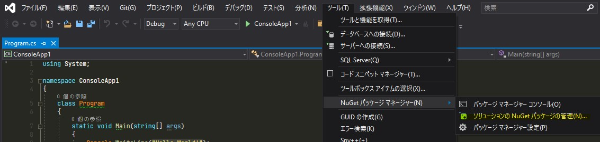

ここでは、コードを書くことで ST-Bridge データを扱う方法について紹介します。
基本的には HoaryFox の内部実装を基にしてどのように処理していくかを紹介していく形になっています。

実際の HoaryFox の実装については様々なケースにエラーなく対応するため複雑になっていますが、ベースとなる動作を理解し必要な場合に自分でカスタマイズするための参考にしてください。

なお、HoaryFox の実装は以下で見ることができます。

- [hrntsm/HoaryFox](https://github.com/hrntsm/HoaryFox/tree/main/HoaryFox/RH7/Component)

## 環境構築

HoaryFox は ST-Bridge のデータの処理に .NET のライブラリである STBDotNet を使っています。
そちらをダウンロードして ST-Bridge をコードから扱う準備をしましょう。

STBDotNet は OSS で開発しているライブラリになります。
コードの中身が気になる方は、以下 GitHub のページから確認してください。

- [STBDotNet](https://github.com/hrntsm/STBDotNet)

公式のドキュメントサイトは以下になります。

- [ドキュメントサイト](https://hiron.dev/STBDotNet/docs/index.html)

### IDE 向け

ここでは VisualStudio のような統合開発環境（IDE）を使ってコードを書く場合の方法について紹介します。

VisualStudio ではパッケージマネージャーを使って nuget から参照してください。
VisualStudio を起動して ツール から NuGet パッケージマネージャー の ソリューションの NuGet パッケージの管理を選択してください。



参照のタブを選び STBDotNet を検索し、対象のプロジェクトにインストールしてください。使用するバージョンは最新のものを推奨します。


### Grasshopper 向け

#### HoaryFox がある場合

HoaryFox が Grasshopper にインストールされている場合は、Grasshopper が 参照している HoaryFox のフォルダ内にある STBDotNet.dll を使用します。
使用する HoaryFox はバージョン 2.1.1 以降を推奨します。

C# Script コンポーネントを配置して、右クリックし Manage Assemblies... を選択してください。


ポップアップしてきた画面の中央上部にある Add から以下のように Grasshopper が使用している HoaryFox のフォルダ内にある STBDotNet.dll を開いてください。


#### HoaryFox がない場合

Nuget のサイトから必要なバージョンをダウンロードしてください。
STBDotNet の ページは以下になります。
ページ右側の Download package からダウンロードができます。

- [Nuget/STBDotNet](https://www.nuget.org/packages/STBDotNet/)

.nuget ファイルをダウンロードしたら、ファイルの拡張子を .zip に変えて解凍してください。
解凍したフォルダの lib/net48/ 内 の STBDotNet.dll を任意の場所に移動して HoaryFox がある場合で紹介した方法と同様に参照してください。

:::note
nuget は C# などが動作している .NET 向けのライブラリがあげられているサイトです。
パッケージマネージャーと言われます。Food4Rhino の C# 版というようなイメージで間違いありません。
:::

## ST-Bridge ファイルの読み込み

例として VisualStudio を使用した例を最初にあげますが、Grasshopper の C# Script コンポーネントを使用する際もコードの内容は同様です。

### コンソールアプリの作成

VisualStudio を起動したらコンソールアプリを作成してください。
プロジェクトの名前を ConsoleApp1 とした場合の例をあげます。
program.cs を以下のように書き換えてください。

```cs title=program.cs
using System;
using STBDotNet.Serialization;
using Version = STBDotNet.Enums.Version;

namespace ConsoleApp1
{
    class Program
    {
        static void Main()
        {
            const string stbPath = "Set Your STB Path";
            object model = Serializer.Deserialize(stbPath, Version.Stb202);

            Console.WriteLine(model);
        }
    }
}
```

こちらを実行するとコンソールには以下のように表示され、`model` にバージョン 2.0.2 の ST-Bridge データが読み込まれたことがわかります。

```
STBDotNet.v202.ST_BRIDGE
```

ファイルを読み込むときは、`STBDotNet.Serialization.Serializer.Deserialize` を使用します。
1 つ目の引数に、.stb ファイルのパス、2 つ目の引数の読み込む .stb ファイルのバージョンを指定します。
戻り値は object 型ですが、内部は各 stb のバージョンのデータになっていますので、使用するときはキャストしてください。

```cs
var model = Serializer.Deserialize(stbPath, Version.Stb202) as STBDotNet.v202.ST_BRIDGE;
```

### データのバージョン取得方法

もし ST-Bridge のバージョンがわからない場合は、以下のメソッドでバージョンを取得することができます。

```cs
Version stbVersion = STBDotNet.Utils.Util.GetStbVersion(stbPath);
```

ですが、ST-Bridge データは xml 形式のテキストデータなので、任意のテキストエディタで確認したほうが早いです。
テキストエディタで開くとデータの冒頭は以下のようになっており、そこでバージョンを確認することができます。  
例えば HoaryFox で書き出した ST-Bridge データの冒頭は以下のようになっており、バージョンが 2.0.2 であることが確認できます。

```xml
<?xml version="1.0" encoding="utf-8"?>
<ST_BRIDGE version="2.0.2" xmlns="https://www.building-smart.or.jp/dl">
  <StbCommon project_name="ExportOptimizedOfficeBuilding2STB.gh" app_name="HoaryFox" />
```

### ST_BRIDGE 型について

v202 の `ST_BRIDGE` 型は以下のようなデータを持っています。

- StbAnaModels
- StbCalData
- StbCommon
- StbExtension
- StbModel
- version

ドキュメントは以下です。

- [STBDotNet.v202.ST_BRIDGE](https://hiron.dev/STBDotNet/docs/STBDotNet.v202.ST_BRIDGE.html)

バージョンごとに若干クラスが持つデータは異なりますが、Model と Common を持つことは共通です。
違うバージョンを使う際はドキュメントを参照してください。

このデータの構成は、ST-Bridge_XML 仕様説明書 に準拠した形になっているので、STBDotNet のドキュメントを見なくても仕様説明書を見るとデータの構成を概ね把握することができます。

仕様書は BuildingSmart Japan の [構造設計小委員会](https://www.building-smart.or.jp/meeting/buildall/structural-design/) のページよりダウンロードしてください。

以下はバージョン 2.0.2 の仕様書の ST_BRIDGE の箇所の抜粋になります。
属性、子要素がそのまま上で示した STBDotNet の ST_BRIDGE 型が持つプロパティとなっています。
これは、この ST_BRIDGE 型に限らず、全てのクラスで共通の形式になります。

> 

データの構造を理解するための例として、書き出したアプリの名前を取得する方法を紹介します。
仕様書を確認すると、アプリ名は `StbCommon` の `app_name` にあることがわかります。
C# で値を取得するしてコンソールに表示する方法は以下になります。

```cs title=Program.cs {12,13,14}
using System;
using STBDotNet.Serialization;
using Version = STBDotNet.Enums.Version;

namespace ConsoleApp1
{
    class Program
    {
        static void Main()
        {
            const string stbPath = "Set Your STB Path";
            var model = Serializer.Deserialize(stbPath, Version.Stb202) as STBDotNet.v202.ST_BRIDGE;
            string appName = model.StbCommon.app_name;
            Console.WriteLine(appName);
        }
    }
}
```

model を取得する際に対象のバージョンの型にキャストし、アプリの名前を取得しています。
アプリの名前の取得の仕方が、仕様書のデータの階層と同様になっていることがわかります。

### Grasshopper の場合

環境構築の箇所であげたように STBDotNet を参照している状態で以下のようにすることでアプリの名前を返すことができます。
path の TypeHint は string にしてください。


```cs title=C#Script_Component
using STBDotNet.Serialization;
using Version = STBDotNet.Enums.Version;

public class Script_Instance : GH_ScriptInstance
{
    private void RunScript(string path, ref object appName)
    {
        var model = Serializer.Deserialize(path, Version.Stb202) as STBDotNet.v202.ST_BRIDGE;
        appName = model.StbCommon.app_name;
    }
}
```

ここでは HoaryFox の Karamba3D 連携機能で書き出した ST-Bridge データを読み込んでいるため、 アプリ名の HoaryFox が出力されています。
