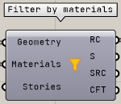

データの入力出力を行うコンポーネントのカテゴリ

---

## MaterialType

材料ごとの分類作成

|入力|説明|
|---|:---:|
|Data|読み取った ST-Bridge ファイルのデータ|

|出力|説明|
|---|:---:|
|Columns|柱の材料情報|
|Girders|大梁の材料情報|
|Posts|間柱の材料情報|
|Beams|小柱の材料情報|
|Braces|ブレースの材料情報|
|Slabs|スラブの材料情報|
|Walls|壁の材料情報|

---

## Story

階ごとの分類作成  
柱、壁、ブレースの所属階は、所属節点の中で上部の節点が属する階を出力します。

|入力|説明|
|---|:---:|
|Data|読み取った ST-Bridge ファイルのデータ|

|出力|説明|
|---|:---:|
|Columns|柱の階情報|
|Girders|大梁の階情報|
|Posts|間柱の階情報|
|Beams|小柱の階情報|
|Braces|ブレースの階情報|
|Slabs|スラブの階情報|
|Walls|壁の階情報|

---

## Filter by Materials

Stb to Brep で作成した Brep を材料、階情報ごとにフィルタリングする。
階情報はブランチで反映する。

|入力|説明|
|---|:---:|
|Geometry|Stb to Brep で作成した Brep|
|Material|MaterialType で作成した材料情報|
|Story|Story で作成した階情報|

|出力|説明|
|---|:---:|
|RC|材料が RC の Brep|
|S|材料が S の Brep|
|SRC|材料が SRC の Brep|
|CFT|材料が CFT の Brep|
