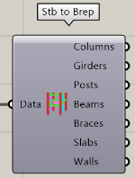
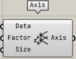

読み込んだ ST-Bridge データから部材を可視化、Bake するコンポーネントのカテゴリ

---

## Stb to Line

部材を Line で表示する

|入力|説明|
|---|:---:|
|Data|Load STB file コンポーネントの Data 出力を入力|
|Bake|各 Line を断面符号ごとにレイヤー分けして Bake する|

|出力|説明|
|---|:---:|
|Nodes| 節点の Point3d のリストを出力|
|Columns| 柱の Line のツリーを出力|
|Girders| 大梁の Line のツリーを出力|
|Posts| 間柱の Line のツリーを出力|
|Beams| 小梁の Line のツリーを出力|
|Braces| ブレースの Line のツリーを出力|

---

## Stb to Brep

部材を Brep で表示する

|入力|説明|
|---|:---:|
|Data|Load STB file コンポーネントの Data 出力を入力|
|Bake|各 Brep を断面符号ごとにレイヤー分けして Bake する|

|出力|説明|
|---|:---:|
|Columns| 柱形状を表す Brep のツリーを出力|
|Girders| 大梁形状を表す Brep のツリーを出力|
|Posts| 間柱形状を表す Brep のツリーを出力|
|Beams| 小梁形状を表す Brep のツリーを出力|
|Braces| ブレース形状を表す Brep のツリーを出力|
|Slabs| スラブ形状を表す Brep のツリーを出力|
|Walls| 壁形状を表す Brep のツリーを出力|

### 表示仕様

- 床、壁の開口は反映されません。
- 平面でないスラブでは近似した面を張るため処理が重い場合があります。

---

## Axis

階と軸をラインで表示する

|入力|説明|
|---|:---:|
|Data|Load STB file コンポーネントの Data 出力を入力|
|Factor|各 Brep を断面符号ごとにレイヤー分けして Bake する|
|Size|各 Brep を断面符号ごとにレイヤー分けして Bake する|

|出力|説明|
|---|:---:|
|Axis| 軸と階を示す Line の出力|