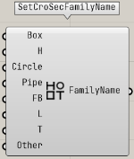

データの入力出力を行うコンポーネントのカテゴリ

---

## Load STB file

ST-Bridge データの読み込み

|入力|説明|
|---|:---:|
|Path|ST-Bridge ファイルのパス|

|出力|説明|
|---|:---:|
|Data|読み取った ST-Bridge ファイルのデータ|

---

## Export STB file

ST-Bridge データの書き出し

|入力|説明|
|---|:---:|
|Node|節点情報, FrameBuilder コンポーネントの Node 出力を入力|
|Axis|軸情報, AxisBuilder コンポーネントの Axis 出力を入力|
|Story|階情報, StoryBuilder コンポーネントの Story 出力を入力|
|Member|部材情報, FrameBuilder コンポーネントの Member 出力を入力|
|Section|断面情報, FrameBuilder コンポーネントの Section 出力を入力|
|Path|作成した ST-Bridge データの出力先を指定。デフォルト値はデスクトップ|
|Out?|出力を行うかのブール値。True にすると出力します|

|出力|説明|
|---|:---:|
|Stb|作成した ST-Bridge データ|

:::important
細かいの使い方・変換仕様は、Usage の [Export ST-Bridge file](../Usage/ExportSTB) の記事も参照してください。
:::

---

## Convert to karamba3D

読み込んだ ST-Bridge データを 構造解析を行うコンポーネントの [Karamba3D](https://www.karamba3d.com/) のデータに変換

|入力|説明|
|---|:---:|
|Data|Load STB file コンポーネントの Data 出力を入力|
|FamilyName|断面のファミリー名の指定。 入力しない場合、SetCroSecFamilyName コンポーネントのデフォルト値が入る|

|出力|説明|
|---|:---:|
|ElementBeam|Karamba3D の梁要素|
|CrossSection|Karamba3D の断面情報|

---

## SetCroSecFamilyName

Karamba3D 内の断面につけるファミリー名の設定を行うコンポーネント。

|入力|説明|
|---|:---:|
|Box| 箱型断面のファミリー名。デフォルトは HF-Box|
|H| H型断面のファミリー名。デフォルトは HF-H|
|Circle| 円形中実断面ファミリー名。デフォルトは HF-Circle|
|Pipe| 円形中空断面の断面ファミリー名。デフォルトは HF-Pipe|
|FB| フラットバーの断面ファミリー名。デフォルトは HF-FB|
|L| L 型断面の断面ファミリー名。デフォルトは HF-L|
|T| T 型断面の断面ファミリー名。デフォルトは HF-T|
|Other| 上記以外の断面ファミリー名。デフォルトは HF-Other|

|出力|説明|
|---|:---:|
|FamilyName|Karamba3D での断面のファミリー名の設定|

:::important
細かいの使い方・変換仕様は、Usage の [Convert to Karamba3D](../Usage/ConvertToKaramba) の記事も参照してください。
:::
