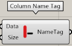
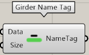
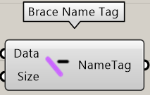

部材符号の表示を行うコンポーネントのカテゴリ

---

## Column Name Tag

柱の部材符号表示

|入力|説明|
|---|:---:|
|Data|Load STB file コンポーネントの Data 出力を入力|
|Size|Rhino のビューポートに表示する文字サイズ。デフォルトは12です|

|出力|説明|
|---|:---:|
|NameTag|符号のリスト|

---

## Post Name Tag

間柱の部材符号表示

|入力|説明|
|---|:---:|
|Data|Load STB file コンポーネントの Data 出力を入力|
|Size|Rhino のビューポートに表示する文字サイズ。デフォルトは12です|

|出力|説明|
|---|:---:|
|NameTag|符号のリスト|

---

## Girder Name Tag

大梁の部材符号表示

|入力|説明|
|---|:---:|
|Data|Load STB file コンポーネントの Data 出力を入力|
|Size|Rhino のビューポートに表示する文字サイズ。デフォルトは12です|

|出力|説明|
|---|:---:|
|NameTag|符号のリスト|

---

## Beam Name Tag

小梁の部材符号表示

|入力|説明|
|---|:---:|
|Data|Load STB file コンポーネントの Data 出力を入力|
|Size|Rhino のビューポートに表示する文字サイズ。デフォルトは12です|

|出力|説明|
|---|:---:|
|NameTag|符号のリスト|

---

## Brace Name Tag

ブレースの部材符号表示

|入力|説明|
|---|:---:|
|Data|Load STB file コンポーネントの Data 出力を入力|
|Size|Rhino のビューポートに表示する文字サイズ。デフォルトは12です|

|出力|説明|
|---|:---:|
|NameTag|符号のリスト|
