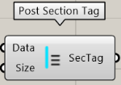
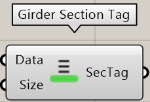
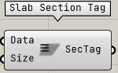
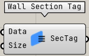

断面情報の表示を行うコンポーネントのカテゴリ

---

## Column Section Tag

柱の断面情報表示

|入力|説明|
|---|:---:|
|Data|Load STB file コンポーネントの Data 出力を入力|
|Size|Rhino のビューポートに表示する文字サイズ。デフォルトは 12|

|出力|説明|
|---|:---:|
|SecTag|符号のツリー|

---

## Post Section Tag

間柱の断面情報表示

|入力|説明|
|---|:---:|
|Data|Load STB file コンポーネントの Data 出力を入力|
|Size|Rhino のビューポートに表示する文字サイズ。デフォルトは 12|

|出力|説明|
|---|:---:|
|SecTag|符号のツリー|

---

## Girder Section Tag

大梁の断面情報表示

|入力|説明|
|---|:---:|
|Data|Load STB file コンポーネントの Data 出力を入力|
|Size|Rhino のビューポートに表示する文字サイズ。デフォルトは 12|

|出力|説明|
|---|:---:|
|SecTag|符号のツリー|

---

## Beam Section Tag

小梁の断面情報表示

|入力|説明|
|---|:---:|
|Data|Load STB file コンポーネントの Data 出力を入力|
|Size|Rhino のビューポートに表示する文字サイズ。デフォルトは 12|

|出力|説明|
|---|:---:|
|SecTag|符号のツリー|

---

## Brace Section Tag

ブレースの断面情報表示

|入力|説明|
|---|:---:|
|Data|Load STB file コンポーネントの Data 出力を入力|
|Size|Rhino のビューポートに表示する文字サイズ。デフォルトは 12|

|出力|説明|
|---|:---:|
|SecTag|符号のツリー|

---

## Slab Section Tag

ブレースの断面情報表示

|入力|説明|
|---|:---:|
|Data|Load STB file コンポーネントの Data 出力を入力|
|Size|Rhino のビューポートに表示する文字サイズ。デフォルトは 12|

|出力|説明|
|---|:---:|
|SecTag|符号のツリー|

---

## Wall Section Tag

ブレースの断面情報表示

|入力|説明|
|---|:---:|
|Data|Load STB file コンポーネントの Data 出力を入力|
|Size|Rhino のビューポートに表示する文字サイズ。デフォルトは 12|

|出力|説明|
|---|:---:|
|SecTag|符号のツリー|
