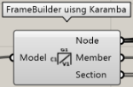

ST-Bridge 書き出しのための情報を作成するコンポーネントのカテゴリ

:::note
使用方法や注意点は [Export ST-Bridge file](../Usage/ExportSTB) にも詳しく書いていますので、そちらも参照してください。
:::

---

## Frame Builder by angle

架構情報を Karamba3D のモデルから作成する。  
柱と梁の区分は グローバル座標の Z 軸に対する角度を Angle に入力し、その角度以内であれば柱として判定。

|入力|説明|
|---|:---:|
|Model|Karamba3D の Model 出力を入力|
|Angle|柱と梁を判定する際に使う角度（rad）|

|出力|説明|
|---|:---:|
|Member|部材情報（StbMembers）|
|Section|断面情報（StbSections）|

---

## Node Builder

節点情報を Karamba3D のモデルから作成する。  

|入力|説明|
|---|:---:|
|Model|Karamba3D の Model 出力を入力|

|出力|説明|
|---|:---:|
|Node|節点情報（StbNodes）|

---

## Axis Builder

軸情報を作成する

|入力|説明|
|---|:---:|
|Node|節点情報、FrameBuilder の Node 出力を入力|
|Distance|原点からの軸の距離（mm）|
|Range|軸の幅（mm）|
|Name|軸の名前|
|Direction|軸の方向|

|出力|説明|
|---|:---:|
|Axis|軸情報（StbAxes）|

---

## Story Builder

階情報を作成する

|入力|説明|
|---|:---:|
|Node|節点情報、FrameBuilder の Node 出力を入力|
|Height|原点からの階の高さ（mm）|
|Range|階の幅（mm）|
|Name|階の名前|

|出力|説明|
|---|:---:|
|Story|階情報（StbStories）|
