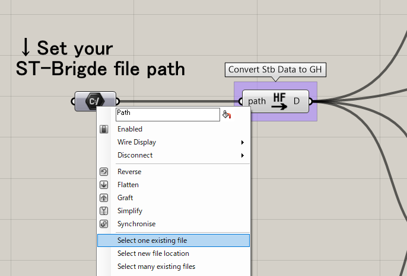

ST-Bridge のモデルを Grasshopper に読み込んで、Rhino へ Bake する方法について説明します。
こちらの内容は Samples フォルダーの ShowStbModel.gh のモデルを参照してください。

## ST-Bridge ファイルを読み込み

ファイルを開くと以下のようになっているため、path コンポーネントを右クリックし Select one existing file を選択し可視化したいstbファイルを選択してください。  
読み込みにエラーがない場合、その隣にある Load STB data コンポーネントでデータの変換が行われます。この出力を各可視化コンポーネントにつなぐことで Rhino のビューポート上に情報が可視化されます。

## ジオメトリの Bake

Stb2Brep コンポーネントと、Stb2Line コンポーネントに Bake 機能がついています。  
Bake の入力に Button などを使用して True を入力すると Rhino へ Bake されます。Bake の状態は以下の画像のようになっています。

レイヤーは、Column、Girder、Post、Beam、Brace、Slab、Wall にわかれ、その中でさらに部材符号ごとのサブレイヤーに分かれます。

Bake されたジオメトリには、メタ情報を追加しています。
ジオメトリを選択し、Properties の Attribute User Text を確認すると、断面サイズなどの値を確認することができるような BIM 的な機能になっています。  
なお、Rhino 側で UserText を編集しても、モデルは Grasshopper 側へは反映されません。

