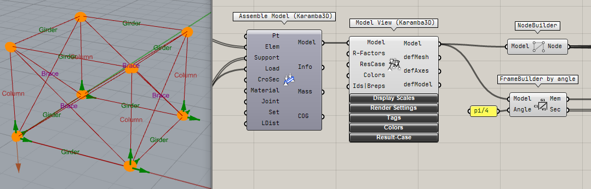
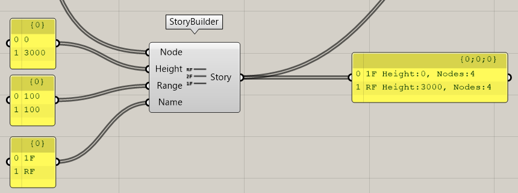
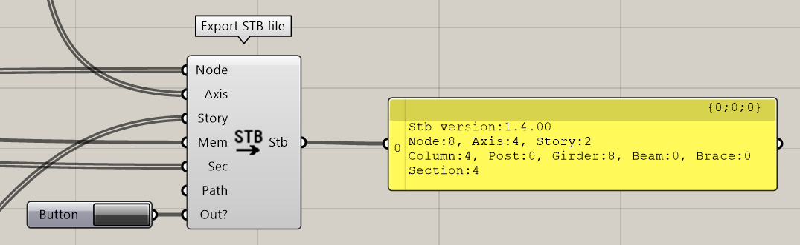

Karamba のデータから ST-Bridge のデータを作成する方法を説明します。こちらの内容は Samples フォルダーの ExportSTB.gh のモデルを参照してください。  
ST-Bridge の version 1.4 の形式で出力を行います。

## Karamba モデルの変換

Karamba で作成したモデルから以下を作成します。
- 節点（StbNodes）
- 部材情報（StbMembers）
- 断面情報（StbSections）

以下のように Karamba の AssmebleModel コンポーネントなどから出力される Model のデータを FrameBuilder using Karamba コンポーネントに入力することでデータを変換します。

:::note
Karamba からの出力に際して、モデル化の注意点についてはこのページの下部の変換仕様を確認してください
:::

## 軸情報の作成

AxisBuilder コンポーネントで軸（StbAxes）のデータを作成します。  
基本的な挙動の考えとしては、Distance で指定した軸から Range の幅（Dist ± Range）にある節点を軸に属する節点として処理します。  
コンポーネントの出力を見ることで、軸の方向、原点からの距離、所属節点数の確認をすることができます。

入力の仕様は以下です。わかりづらいので今後改良予定です。リストで入力し、同一のインデックスでの入力をマッチさせて変換します。
- Node: 節点情報です。FrameBuilder の出力の Node を入れてください
- Distance: 原点からの軸の距離を指定してください。
  - 軸の方向は全体座標系での X 軸または Y 軸に平行になります。
  - 指定した Distance が X 方向か Y 方向かについては Direction の入力で指定します
- Range: Distance で設定した軸に対して節点を所属させる幅を指定します。
  - 節点座標を浮動小数点で持っている関係上、たとえ全ての節点が軸上のある場合でも 0 よりも大きな値を設定することを推奨します。
- Name: 軸の名前になります。
- Direction: 軸の方向を指定します。
  - 0 は X 方向、1 は Y 方向の軸として処理します。

## 階情報の作成

StoryBuilder コンポーネントで階（StbStories）のデータを作成します。  
基本的な挙動は AxisBuilder コンポーネントと同様です。  
コンポーネントの出力を見ることで、階名、階高、所属節点数の確認をすることができます。

- Node: 節点情報です。FrameBuilder の出力の Node を入れてください。
- Height: 階高の情報です。原点からの高さを入力してください。
- Range: Height で指定した階に対して節点を所属させる幅を指定します。
- Name: 階の名前になります。

## データの出力

上記の3つで変換したデータを全て Export STB file コンポーネントに入力することでデータをまとめて1つの ST-Bridge ファイルを作成します。  
Path で指定したパスに STB ファイルを出力します。指定しない場合、デスクトップに model.stb というファイルで出力されます。  
Out? の値を True にするとファイルが出力されます。出力を確認することでデータの変換状況の概略を確認することができます。

---

## 変換の仕様

以下の仕様により ST-Brige データの作成を行います。

### 対象

- ST-Bridge version 1.4 の形式で出力します。
- 柱、梁、ブレースを変換し、床壁のような面材は変換しません

:::note
ST-Bridge version 2 の形式での出力には今後対応予定です。
:::

### 部材の判別

- Karamba のモデルでは、柱梁ブレースの区別がないため以下の仕様で判定しています
  - Karamba でトラス要素として扱っているものはブレースとして変換
  - 全体座標系の Z 軸に対しての部材の角度が45度未満である部材は柱、45度以上の場合は梁として変換
- 部材の判別は ST-Bridge における StbMember 内での各表現に対応します（例えば StbColumn など）
- STB の梁部材には、部材が基礎部材かのフラグ（isFoundation）があるが全て False で出力します

### 材質の判別

- Karamba の 材料を作成する際に設定する Family の名前が "Steel" の場合は S 部材、"Concrete" の場合は RC 部材とします
- 材質の判別は ST-Bridge における StbSections 内での各表現に対応します（例えば StbSecColumn_RC など）

:::important
材料の Family 名が上記以外の場合エラーになります
:::

### 部材名称

- Karamba 内での名称は使用しません
- Karamba が内部的に持っている部材の順番で、柱ならば C、梁ならば G、ブレースならば V と数字の組み合わせで名称を付けます。（C1, G1 など）

### 断面名称

- Karamba の Cross Section コンポーネントの Name で設定した名称で断面を作成します

:::important
Name の設定ごとに STB ファイルに出力しているため、必ず Name を設定するようにしてください  
Name が重複している場合、HoaryFox のコンバーターでは同一断面として処理するため、1つの断面しか出力されません。
:::

### 断面形状

- Karamba で設定した断面の形状に合わせてSTBに出力します
- 変換にエラーがある時は、10mmの角材として出力します
- RC 断面は Karamba では配筋情報を持たないため以下で出力します
  - 主筋: 梁ならば 上端も下端も 3-D22、柱ならば 8-D22
  - せん断補強筋: 2-D10@100
- S 断面の場合、材質は フランジ、ウェブともに SN400 として出力します

:::note
非対応機能も要望があれば適宜対応しますので、Contact よりご連絡ください。
:::