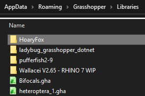

## インストール方法

HoaryFox のインストール方法について紹介します。

1. Food4Rhino の [HoaryFox](https://www.food4rhino.com/app/hoaryfox) のサイトからファイルをダウンロード
    - HoaryFox のバージョン 2 以降は ST-Bridge のバージョン 2 のみの対応となります。
    - ST-Bridge のバージョン 1 のデータを扱う場合は HoaryFox のバージョン 1.3 を使用してください。
1. ダウンロードした zip ファイルを右クリックしプロパティから全般のタブの中にあるセキュリティの項目を「許可する」にし、zip を解凍する
1. Grasshopper を起動して File > Special Folders > Components folder を選択することで表示されるフォルダに、1. でダウンロードしたフォルダの中にある 「HoaryFox」 という名前のフォルダを入れる
    - バージョン 2 からは Rhino と Karamba3D の組み合わせごとにフォルダが分かれています。ご使用の環境にあったものを選択してください。
1. Rhino を再起動する

以下のような形になります。

:::note
うまく動作しない場合は 2. のやり忘れの場合が多いです。注意してください。
:::

## 動作環境

対応OS
- Windows
- Mac 
  - Karamba3D 連携については、Mac 版の Karamba3D がないため動きません

対応バージョン
- Rhino6
  - Karamba3D 1.3.3
  - Karamba3D 2.2.0
- Rhino7
  - Karamba3D 1.3.3
  - Karamba3D 2.2.0

## Karamba3D との連携

Karamba3D との連携機能を使う場合は Karamba.gha と同じフォルダに KarambaConnect フォルダ以下のファイルを移動してください。
Karamba.gha はデフォルトでは C:\Program Files\Rhino xx\Plugins\Karamba (xx は Rhino のバージョン)にあります。  

HoaryFox v2.1 を Rhino7 で使う場合は以下のようになります。
連携機能を使用する場合は、HoaryFox v2.1 以降を使用することを推奨します。

:::note
HoaryFox の場合と異なり上記のように **必ず** フォルダから出して直に karamba フォルダにファイルを入れてください。
:::

## 各ソフトとの連携の概要

HoaryFox は下図のように ST-Bridge を介して Rhinoceros/Grasshopper/Karamba3D と BIM ソフト、一貫構造計算との連携を行うことができます。

詳細は各コンポーネントの紹介ページを参照してください。

