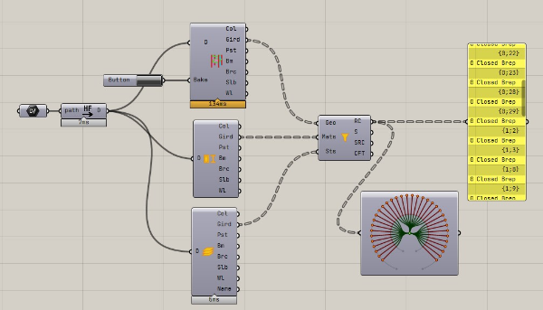
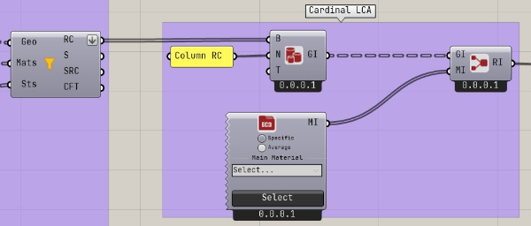

ST-Bridge のモデルを Grasshopper に読み込んで、LCA 解析を実行する方法を説明します。こちらの内容は Samples フォルダーの Filter2LCA.gh のモデルを参照してください。

この例では LCA 解析自体は [Cardinal LCA](https://www.food4rhino.com/en/app/cardinal-lca) というコンポーネントを使用して行うため、必要に応じてインストールしてください。

:::important
本機能は試験的な機能なので注意してください。
:::

## LCA 解析とは

[Wikipedia](https://ja.wikipedia.org/wiki/%E3%83%A9%E3%82%A4%E3%83%95%E3%82%B5%E3%82%A4%E3%82%AF%E3%83%AB%E3%82%A2%E3%82%BB%E3%82%B9%E3%83%A1%E3%83%B3%E3%83%88) より引用

> ライフサイクルアセスメント (life-cycle assessment: LCA) とは製品やサービスに対する、環境影響評価の手法のこと。
>
>「環境アセスメント」では、主に大規模開発等による環境への影響を予め評価することを目的とするが、「ライフサイクルアセスメント」では、主に個別の商品の製造、輸送、販売、使用、廃棄、再利用までの各段階における環境負荷を明らかにし、その改善策をステークホルダーと伴に議論し検討する。
> また、このような環境負荷の少ない商品の開発や設計については特に、『環境配慮設計』と呼ばれ、「環境工学」の一分野にもなっている。
>
> また、代替製品や新製品の環境負荷を、既存の製品と比較し、より環境負荷の少ない製品、サービスへの切り替えを行う意思決定のツールでもある。
> 近年では、カーボンフットプリントなど「環境負荷の見える化」のための指標を計算するためのツールとしても用いられている。

例えば日本建築学会では [LCA 小委員会](http://news-sv.aij.or.jp/tkankyo/s5/) が設置されており、「建築のLCA指針」などが発刊されています。

SNS を見ていると欧米では建築構造のプロポーザルに LCA 解析を行い、如何に環境負荷を構造でも考慮しているかに価値がおかれる場合があるような印象を受けました。
そのため、それを日本でも行いやすくするための支援ツールとして試しに実装しました。

## Cardinal LCA について

公式サイトは以下です。
なお例としてこのコンポーネントを使用しているだけで、本サイトは結果の保証、使用の推奨をしているわけではありません。
- [Cardinal LCA](https://www.cardinallca.com/#)

使い方については、Food4Rhino に Demo ファイルがあるので、そちらを参照してください。
基本的な使い方としては、計算したい材料の体積と LCA 解析に必要な材料パラメータを入力すると材料ごとに計算結果が出力されます。

デフォルトで材料情報は入っていますが、欧米向けの材料情報なので、例えば上記の日本建築学会の資料などを参考に対象建設地での LCA 解析に必要な材料情報を設定する必要があります。

## ST-Bridge ファイルを読み込み

ファイルを開くと以下のようになっているため、path コンポーネントを右クリックし Select one existing file を選択し可視化したいstbファイルを選択してください。  
読み込みにエラーがない場合、その隣にある Load STB data コンポーネントでデータの変換が行われます。この出力を各可視化コンポーネントにつなぐことで Rhino のビューポート上に情報が可視化されます。

こちらで変換された Brep の体積を使用して LCA 解析を実行します。

:::important
ST-Bridge データには部材の形状、断面情報は含まれますが体積は含まれないため Brep の体積を Rhino の機能で求めて使用しています。
例えば スラブ-梁部材、仕口などで Brep は重複する場合がありますが、重複分を引くといった処理はしていません。  
体積の正確性については確認の上、使用お願いいたします。
:::

## ジオメトリのフィルタリング 

Stb to Brep コンポーネントでは材料ごとに分類された出力ではないため、Filter by materials コンポーネントを使って材料ごとに Brep をフィルタリングします。

Material Type コンポーネントと Story コンポーネントを使うことで、 Brep のツリー構造と合わせた形で部材の材料情報、階情報を出力するので、その情報を Filter に入力することで、分類がされます。
フィルターの結果は以下のようにツリー構造で出力されます。  

各ブランチは階情報に対応しており、例えば {0;1} のデータは最初の階に属する部材、 {1;25} のデータは2つ目の階に属する部材を表します。
Filter の 3 つ目の Story(Sts) の入力は任意になっており、 Story の入力がない場合は全て 0 のブランチに属するようになります。

このコンポーネントを使うことで、材質ごとに分類された Brep を取得します。

## 解析用材料の設定

Filter した Brep を Cardinal LCA の BrepImport コンポーネントに入力します。
Name には適切な名前をつけてください。これが材料名になります。

材料は Cardinal LCA についている EC3 のデータベースの値を使用していますが、必要に応じて適切な値を設定してください。

## 結果の可視化

材料ごとに作成した ReportInfo をまとめて Report コンポーネントに入力することでデータがまとめられグラフ化されます。

