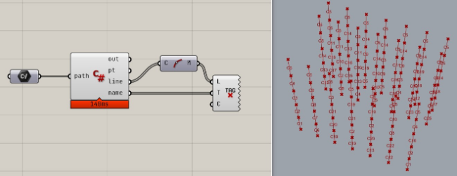

In this section, we will show you how to get nodal and member information and export the lines and their information in Rhino.

## About the structure of ST-Bridge data

First of all, I would like to briefly explain the data structure of ST-Bridge in order to make it easier to find where the information is.
The basic image of ST-Bridge data structure is as follows: "There are nodes, beams between the nodes, and cross-sectional information on the beams.

For example, the model position and cross-section information is contained in `StbModel`, which is structured as follows.
You can use `StbMember` to get the information of a part, and `StbSections` to get the information of a section.

```
ST_BRIDGE
└───StbModel
    ├───StbAxes
    ├───StbJoints
    ├───StbMembers
    ├───StbNodes
    ├───StbSections
    └───StbStories
```

The reference between each data is done by id.  
For example, `column A` is connected to `nodes 1-2` and has a cross section of `section number 5`.
So, if you want to know the nodal coordinates of column A, you have to find the ones with id 1 and 2 in StbNodes, and if you want to know the cross section, you have to find the one with id 5 in StbSections.

One thing that is a bit confusing is which floor and axis the member belongs to.  
In ST-Bridge data, members do not have any axis or floor information.
All the nodes belong somewhere, so you get the floor and axis information of the member by getting the values from the nodes that belong to the member.

## Get nodal information

Get a list of nodes, which are the most basic elements of a part.  
You can get the node information from [StbNode](https://hiron.dev/STBDotNet/docs/STBDotNet.v202.StbNode.html), which is returned as an array from `StbNodes`.

```cs
StbNode[] nodes = model.StbModel.StbNodes;
```

StbNode is a class that holds the id and coordinate information of nodes.
The specification does not require that the array index and the StbNode's id match, so be sure to use the id when referring to a node of a member.
For example, to retrieve a node with an id of "1", you can write the following using Linq

```cs {1,4}
// using System.Linq
StbNode[] nodes = model.StbModel.StbNodes;
StbNode node1 = nodes.FirstOrDefault(n => n.id == "1");
```

FirstOrDefault is a method that returns the first value from the array for which the condition is true, or Default if not found (or null if not specified).

:::important
Note that the id is often given as a number, but the format of the data is a string.
:::

### Drawing with Point3d

If you want to visualize it as Rhino's Point3d, you can create a Point3d array from the obtained nodal information as follows.
If you are using a console application, please refer to Rhino3dm instead of RhinoCommon.

```cs {4}
// using System.Linq
StbNode[] nodes = model.StbModel.StbNodes;
Point3d[] pts = nodes.Select(n => new Point3d(n.x, n.y, n.z)).ToArray();
```

Now that we have the list of nodes, let's get the member information.

## Getting member information

In this section, we will show you how to get the information of a column among the members as an example.
The column information is in `StbColumn`, so we will get its value.

```cs
StbColumn[] columns = model.StbModel.StbColumns;
```

To find out what value `StbColumn` should have, please refer to the specification document or the STBDotNet documentation below.

- [StbColumn document page](https://hiron.dev/STBDotNet/docs/STBDotNet.v202.StbColumn.html)

### Drawing with Line

If there are no intermediate nodes, there will be two nodes, `id_node_bottom` and `id_node_top`.
You can get the id obtained from these two, and get the nodal coordinates from the nodal id information as in the previous section.

Once we have the start and end points of the member, we can use them to create the line of the member.

```cs
StbNode[] nodes = model.StbModel.StbNodes;
StbColumn[] columns = model.StbModel.StbMembers.StbColumns;

var pts = new Point3d[columns.length, 2];

foreach ((StbColumn column, int i) in columns.Select((column, index) => (column, index)))
{
    StbNode nodeStart = nodes.FirstOrDefault(n => n.id == column.id_node_bottom);
    StbNode nodeEnd = nodes.FirstOrDefault(n => n.id == column.id_node_top);

    pts[i, 0] = new Point3d(nodeStart.X, nodeStart.Y, nodeStart.Z);
    pts[i, 1] = new Point3d(nodeEnd.X, nodeEnd.Y, nodeEnd.Z);

    lines[i] = new Line(pts[i, 0], pts[i, 1]);
}
```

:::note
If you want to draw the member more accurately, for example, StbColumn contains offset and rotate properties, which can be reflected in the end node coordinates to take into account the offset and rotation of the column.
:::

### Get section information for a part

The code of a part can be obtained from the `name` property.
The `name` property can be used to obtain the sign of the part. The name depends on the exporting software, but it can be a name expressed as floor + sign, such as 2C1.
It is the name of the member, not the cross section.

Information about the cross section shape can be obtained from the `id_section` property.
As in the case of nodes, this is a string that represents the id in `StbSections` that has the actual section information.

These can be obtained as follows, as in the case of nodes above.


```cs
var names = new string[columns.Length];
var idSection = new string[columns.Length];

foreach ((StbColumn column, int i) in columns.Select((column, index) => (column, index)))
{
    names[i] = column.name;
    idSection[i] = column.id_section;
}
```

The cross-sectional information is organized as follows.
Although omitted, the cross-sectional information is maintained for each structural type of each part.

```
ST_BRIDGE
└───StbSections
    ├───StbSecColumn_RC
    ├───StbSecColumn_S
    ├───StbSecColumn_SRC
    ├───StbSecColumn_CFT
    ├───StbSecBeam_RC
    ├───StbSecBeam_S
    ├───StbSecBeam_SRC
    ├───StbSecBrace_S
    ├───StbSecSteel
    ...
```

The id retrieved by `id_section` is unique in `StbSections`. Therefore, we need to check if the corresponding id exists in each class.

In the case of a column, it looks like the following.

```cs
var sectionNames = new string[columns.Length];
StbSections sections = model.StbModel.StbSections;

foreach ((string id, int i) in idSection.Select((id, index) => (id, index)))
{
    var hasName = false;

    if (sections.StbSecColumn_RC != null)
    {
        foreach (StbSecColumn_RC columnRc in sections.StbSecColumn_RC)
        {
            if (columnRc.id != id) continue;
            sectionNames[i] = columnRc.name;
            hasName = true;
            break;
        }
    }

    if (sections.StbSecColumn_S != null && !hasName)
    {
        foreach (StbSecColumn_S columnS in sections.StbSecColumn_S)
        {
            if (columnS.id != id) continue;
            sectionNames[i] = columnS.name;
            break;
        }
    }
}
```

Since we don't know where the id corresponds to until we check it, we need to check it one by one as shown above.

Although not used this time, the structure type can be obtained by `kind_structure` in `StbColumn`, so you can determine in advance which structure type is used for the XX part of StbSecColum_XX.

:::note
RC members such as `StbSecXXX_RC` contain information such as the outline of the cross-section and reinforcement, but steel members such as `StbSecXXX_S` can only get the shape name of the cross-section (e.g. H-300x150x10x15), not the specific shape information.  
Specific cross-sectional information for steel members is contained in `StbSecSteel`. It is necessary to find a child element of StbSecSteel that has a shape name that matches the shape name of the obtained cross section, using the same concept as the id of nodes, etc. Steel frames require a little more work than RC.
:::

## Create C# Script Component

Based on what we have learned so far, we will create a component that can be used to tag lines in Grasshopper.

We will use the TextTag component for the tagging itself, and write a C# Script component that outputs the string to be tagged and the Line to which it will be attached.

The contents of the component should look like this The content of the component should be as follows, based on what we have written so far.

```cs title=C#Script_Component
using System.Linq;
using STBDotNet.Serialization;
using STBDotNet.v202;
using Version = STBDotNet.Enums.Version;

public class Script_Instance: GH_ScriptInstance
{
    private void RunScript(string path, ref object pt, ref object line, ref object name)
    {
        var model = Serializer.Deserialize(path, Version.Stb202) as ST_BRIDGE;

        StbNode[] nodes = model.StbModel.StbNodes;
        StbColumn[] columns = model.StbModel.StbMembers.StbColumns;

        var pts = new Point3d[columns.Length, 2];
        var lines = new Line[columns.Length];
        var idSection = new string[columns.Length];
        var sectionNames = new string[columns.Length];

        for (var i = 0; i < columns.Length; i++)
        {
            StbNode nodeStart = nodes.FirstOrDefault(n => n.id == columns[i].id_node_bottom);
            StbNode nodeEnd = nodes.FirstOrDefault(n => n.id == columns[i].id_node_top);

            pts[i, 0] = new Point3d(nodeStart.X, nodeStart.Y, nodeStart.Z);
            pts[i, 1] = new Point3d(nodeEnd.X, nodeEnd.Y, nodeEnd.Z);
            lines[i] = new Line(pts[i, 0], pts[i, 1]);

            idSection[i] = columns[i].id_section;
        }

        StbSections sections = model.StbModel.StbSections;

        for (var i = 0; i < idSection.Length; i++)
        {
            var hasName = false;

            if (sections.StbSecColumn_RC != null)
            {
                foreach (StbSecColumn_RC columnRc in sections.StbSecColumn_RC)
                {
                    if (columnRc.id != idSection[i]) continue;
                    sectionNames[i] = columnRc.name;
                    hasName = true;
                    break;
                }
            }

            if (sections.StbSecColumn_S != null && !hasName)
            {
                foreach (StbSecColumn_S columnS in sections.StbSecColumn_S)
                {
                    if (columnS.id != idSection[i]) continue;
                    sectionNames[i] = columnS.name;
                    break;
                }
            }
        }

        pt = pts;
        line = lines;
        name = sectionNames;
    }
}
```

The results are shown below. I used the data in the HoaryFox Sample folder to create the diagram.

I used the CurveMiddle component to get the midpoint of each line, and assigned a tag to that point using TextTag.
Since the model is the result of cross-sectional optimization using Grasshopper and Karamba3D, there are many cross-sections, which are shown in the figure.


