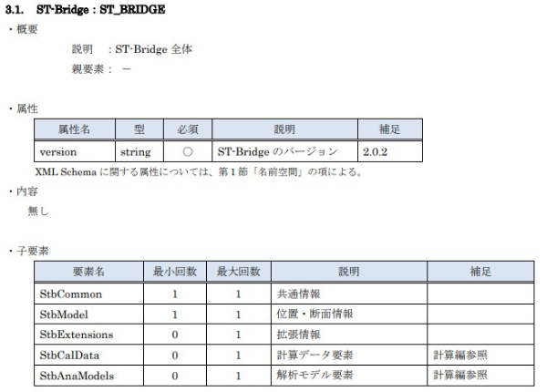
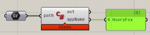

In this section, I will show you how to handle ST-Bridge data by writing code.
Basically, I will show you how to handle ST-Bridge data based on the internal implementation of HoaryFox.

The actual implementation of HoaryFox is complicated to handle various cases without errors, but please refer to it to understand the base behavior and customize it yourself if necessary.

The details of the HoaryFox implementation can be seen below.

- [hrntsm/HoaryFox](https://github.com/hrntsm/HoaryFox/tree/main/HoaryFox/RH7/Component)

## Environment

HoaryFox uses STBDotNet, a .NET library, to process ST-Bridge data.
NET library to process ST-Bridge data. Download it and get ready to handle ST-Bridge from code.

STBDotNet is a library that is being developed by OSS.
If you are interested in the contents of the code, please check the GitHub page below.

- [STBDotNet](https://github.com/hrntsm/STBDotNet)

Official documentation site is blow.

- [Document site](https://hiron.dev/STBDotNet/docs/index.html)

### For IDE

This section will show you how to write code using an Integrated Development Environment (IDE) such as VisualStudio.

In VisualStudio, you can use the package manager to browse through nuget.
Start VisualStudio, go to Tools, NuGet Package Manager and select Manage NuGet packages in Solutions.


Select the Browse tab, search for STBDotNet, and install it in the target project. It is recommended that you use the latest version.


### For Grasshopper

#### HoaryFox is installed

If HoaryFox is installed in Grasshopper, use STBDotNet.dll, which is located in the HoaryFox folder referenced by Grasshopper.
It is recommended to use HoaryFox version 2.1.1 or later.

Place the C# Script component, right click and select Manage Assemblies.... 


Open the STBDotNet.dll file in the HoaryFox folder used by Grasshopper from the Add menu at the top center of the screen that pops up, as shown below.


#### HoaryFox is not installed

Please download STBDotNet library from Nuget.

- [Nuget/STBDotNet](https://www.nuget.org/packages/STBDotNet/)

Once you have downloaded the .nuget file, change the file extension to .zip and unzip it.
In the extracted folder, move STBDotNet.dll in lib/net48/ to the desired location and refer to the same method described in the case of HoaryFox.

:::note
NET running C#, etc. nuget is a package manager.
It's called a package manager, and it's a C# version of Food4Rhino.
:::

## Load ST-Bridge file

The first example is using VisualStudio, but the code is the same when using Grasshopper's C# Script component.

### Create a console app

After launching VisualStudio, create a console app.
Here is an example with a project name of ConsoleApp1.
Rewrite program.cs as follows.

```cs title=program.cs
using System;
using STBDotNet.Serialization;
using Version = STBDotNet.Enums.Version;

namespace ConsoleApp1
{
    class Program
    {
        static void Main()
        {
            const string stbPath = "Set Your STB Path";
            object model = Serializer.Deserialize(stbPath, Version.Stb202);

            Console.WriteLine(model);
        }
    }
}
```

When you run this, the console will show the following, indicating that the ST-Bridge data of version 2.0.2 has been loaded into `model`.

```
STBDotNet.v202.ST_BRIDGE
```

When reading the file, use `STBDotNet.Serialization.Serializer.Deserialize`.
The first argument is the path to the .stb file and the version of the .stb file to read in the second argument.
The return value is of type object, but the internal data is for each stb version, so cast it when using it.

```cs
var model = Serializer.Deserialize(stbPath, Version.Stb202) as STBDotNet.v202.ST_BRIDGE;
```

### Get data version

If you do not know the version of ST-Bridge, you can use the following method to get the version.

```cs
Version stbVersion = STBDotNet.Utils.Util.GetStbVersion(stbPath);
```

However, since the ST-Bridge data is text data in xml format, it is faster to check it with any text editor.
If you open the data in a text editor, the beginning of the data will look like this, and you can check the version there.  
For example, the beginning of the ST-Bridge data exported by HoaryFox looks like the following, and you can confirm that the version is 2.0.2.

```xml
<?xml version="1.0" encoding="utf-8"?>
<ST_BRIDGE version="2.0.2" xmlns="https://www.building-smart.or.jp/dl">
  <StbCommon project_name="ExportOptimizedOfficeBuilding2STB.gh" app_name="HoaryFox" />
```

### About ST_BRIDGE class

The `ST_BRIDGE` type of v202 has the following data.

- StbAnaModels
- StbCalData
- StbCommon
- StbExtension
- StbModel
- version

Document is blow.

- [STBDotNet.v202.ST_BRIDGE](https://hiron.dev/STBDotNet/docs/STBDotNet.v202.ST_BRIDGE.html)

Each version of the class has slightly different data, but they all have Model and Common in common.
If you use a different version, please refer to the documentation.

The structure of this data is based on the ST-Bridge_XML specification document, so you can get a general idea of the structure of the data by looking at the specification document without looking at the STBDotNet documentation.

You can download the specification from the [Structural Design Subcommittee](https://www.building-smart.or.jp/meeting/buildall/structural-design/) page of BuildingSmart Japan.

The following is an excerpt from the ST_BRIDGE section of the version 2.0.2 specification.
The attributes and child elements are the properties of the ST_BRIDGE type of STBDotNet shown above.
This is a common format for all classes, not just this ST_BRIDGE type.

> 

As an example to understand the structure of the data, we will show you how to get the name of the exported app.
If you check the specification, you will see that the app name is in `app_name` of `StbCommon`.
Here is how to get the value in C# and display it in the console.

```cs title=Program.cs {12,13,14}
using System;
using STBDotNet.Serialization;
using Version = STBDotNet.Enums.Version;

namespace ConsoleApp1
{
    class Program
    {
        static void Main()
        {
            const string stbPath = "Set Your STB Path";
            var model = Serializer.Deserialize(stbPath, Version.Stb202) as STBDotNet.v202.ST_BRIDGE;
            string appName = model.StbCommon.app_name;
            Console.WriteLine(appName);
        }
    }
}
```

When we get the model, we cast it to the type of the target version and get the name of the app.
You can see that the way to get the name of the app is similar to the data hierarchy in the specification.

### For Grasshopper

As mentioned in the environment setup section, we can return the name of the app by doing the following while referencing STBDotNet.
The TypeHint of the path should be a string.



```cs title=C#Script_Component
using STBDotNet.Serialization;
using Version = STBDotNet.Enums.Version;

public class Script_Instance : GH_ScriptInstance
{
    private void RunScript(string path, ref object appName)
    {
        var model = Serializer.Deserialize(path, Version.Stb202) as STBDotNet.v202.ST_BRIDGE;
        appName = model.StbCommon.app_name;
    }
}
```

In this example, the ST-Bridge data exported by HoaryFox's Karamba3D collaboration function is imported, so the application name HoaryFox is output.
