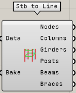

Category of components to be visualized and baked from loaded STB data

---

## Stb to Line

Display a part as a Line

| Input |                             Explanation                             |
| ----- | :-----------------------------------------------------------------: |
| Data  |        Load STB file Input the Data output of the component         |
| Bake  | Layers each Line according to its cross-sectional sign and bakes it |

| Output  |           Explanation            |
| ------- | :------------------------------: |
| Nodes   | Output the Point3d list of nodes |
| Columns |   Output list of column lines    |
| Posts   | output list of intercolumn lines |
| Beams   | Output list of small beam lines  |
| Braces  |   output list of braces lines    |

## Stb to Brep

Display a component in Brep.

| Input |                     Explanation                      |
| ----- | :--------------------------------------------------: |
| Data  | Load STB file Input the Data output of the component |
| Bake  |    Bake each Brep layered by cross-sectional code    |

| Output  |                   Explanation                    |
| ------- | :----------------------------------------------: |
| Columns | Output list of Brep's representing column shapes |
| Girders |          Output list of breps for beams          |
| Posts   |         Output list of Brep for columns          |
| Beams   |    Output list of Brep for small beam shapes     |
| Braces  |         output list of breps for braces          |
| Slabs   |       output list of Brep for slab shapes        |
| Walls   |      output a list of Brep for wall shapes       |

### Display specification

- Walls should include openings.
- Slabs may not output properly if they are concave
