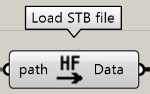

Categories of components that perform data input and output

---

## Load STB file

Load STB data

| Input |      Explanation       |
| ----- | :--------------------: |
| Path  | path of ST-Bridge file |

| Output |           Description           |
| ------ | :-----------------------------: |
| Data   | Data of the read ST-Bridge file |

## Export STB file

Exporting STB data

| Input   |                                       Description                                       |
| ------- | :-------------------------------------------------------------------------------------: |
| Node    |             Nodal information, input Node output of FrameBuilder component              |
| Axis    |             axis information, input Axis output from AxisBuilder component              |
| Story   |         Story information, enter the Story output of the StoryBuilder component         |
| Member  |        Member information, enter the Member output of the FrameBuilder component        |
| Section |       Section information, enter the Section output of the FrameBuilder component       |
| Path    | Specify the output destination for the created ST-Bridge data. Default value is desktop |
| Out?    |             Boolean value for whether to output; if true, output will occur             |

| Output |      Description       |
| ------ | :--------------------: |
| Stb    | Created ST-Bridge data |

The detailed usage and conversion specification of this component can be found in [Export ST-Bridge file](./Usage/ExportSTB) article.

---

## Convert to karamba

Convert the read STB data to the data of the component [Karamba3D](https://www.karamba3d.com/) for structural analysis

| Input      |                                                                  Explanation                                                                  |
| ---------- | :-------------------------------------------------------------------------------------------------------------------------------------------: |
| Data       |                                               Load STB file Input data output of the component                                                |
| FamilyName | Specification of the family name of the cross section.  If not entered, the default value of the SetCroSecFamilyName component is entered |

| Output       |               Description               |
| ------------ | :-------------------------------------: |
| ElementBeam  |         Karamba3D beam element          |
| CrossSection | Cross section information for Karamba3D |

---

## SetCroSecFamilyName

A component that sets the family name for the cross section in Karamba3D.

| Input  |                               Description                               |
| ------ | :---------------------------------------------------------------------: |
| Box    |       Family name for box-shaped cross section. Default is HF-Box       |
| H      |        Family name for H-shaped cross sections. Defaults to HF-H        |
| Circle |  Family name for circular solid cross sections. Defaults to HF-Circle   |
| Pipe   |   Family name for circular hollow cross sections. Defaults to HF-Pipe   |
| FB     |       Cross section family name for flat bars. Defaults to HF-FB        |
| L      | Cross section family name for L-shaped cross sections. Default is HF-L  |
| T      | Cross section family name for T-shaped cross sections. Defaults to HF-T |
| Other  |          Other cross section family names. Default is HF-Other          |

| Output     |                        Description                         |
| ---------- | :--------------------------------------------------------: |
| FamilyName | Setting the family name of the cross section in Karamba3D. |

The detailed usage and conversion specification of this component can be found in the [Convert to Karamba3D](./Usage/ConvertToKaramba) article.
