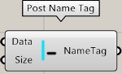
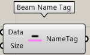

Category of components that display name tags.

---

## Column Name Tag

Display the member tags of a column

| Input |                         Explanation                          |
| ----- | :----------------------------------------------------------: |
| Data  |     Load STB file Input the Data output of the component     |
| Size  | Character size to display in Rhino's viewport. Default is 12 |

| Output  | Description  |
| ------- | :----------: |
| NameTag | List of tags |

---

## Post Name Tag

Display the tags of a member of a column

| Input |                         Explanation                          |
| ----- | :----------------------------------------------------------: |
| Data  |       Load STB file Input Data output of the component       |
| Size  | Character size to display in Rhino's viewport. Default is 12 |

| Output  | Description  |
| ------- | :----------: |
| NameTag | List of tags |

---

## Girder Name Tag

Display the member tags of a large beam

| Input |                         Explanation                          |
| ----- | :----------------------------------------------------------: |
| Data  |     Load STB file Input the Data output of the component     |
| Size  | Character size to display in Rhino's viewport. Default is 12 |

| Output  | Description  |
| ------- | :----------: |
| NameTag | List of tags |

---

## Beam Name Tag

Display the tags of a small beam component

| Input |                         Explanation                          |
| ----- | :----------------------------------------------------------: |
| Data  |     Load STB file Input the Data output of the component     |
| Size  | Character size to display in Rhino's viewport. Default is 12 |

| Output  | Description  |
| ------- | :----------: |
| NameTag | List of tags |

---

## Brace Name Tag

Display the brace's member tags.

| Input |                         Explanation                          |
| ----- | :----------------------------------------------------------: |
| Data  |     Load STB file Input the Data output of the component     |
| Size  | Character size to display in Rhino's viewport. Default is 12 |

| Output  | Description  |
| ------- | :----------: |
| NameTag | list of tags |
