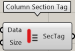
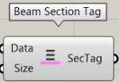
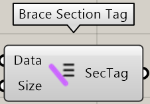

Category of components that display cross-sectional information.

---

## Column Section Tag

Display column section information

| Input |                         Explanation                          |
| ----- | :----------------------------------------------------------: |
| Data  |     Load STB file Input the Data output of the component     |
| Size  | Character size to display in Rhino's viewport. Default is 12 |

| Output | Description  |
| ------ | :----------: |
| SecTag | list of tags |

---

## Post Section Tag

Display cross-sectional information for columns

| Input |                         Explanation                          |
| ----- | :----------------------------------------------------------: |
| Data  |     Load STB file Input the Data output of the component     |
| Size  | Character size to display in Rhino's viewport. Default is 12 |

| Output | Description  |
| ------ | :----------: |
| SecTag | list of tags |

---

## Girder Section Tag

Display cross-section information for large beams

| Input |                         Explanation                          |
| ----- | :----------------------------------------------------------: |
| Data  |     Load STB file Input the Data output of the component     |
| Size  | Character size to display in Rhino's viewport. Default is 12 |

| Output | Description  |
| ------ | :----------: |
| SecTag | list of tags |

---

## Beam Section Tag

Display cross section information for small beams

| Input |                         Explanation                          |
| ----- | :----------------------------------------------------------: |
| Data  |     Load STB file Input the Data output of the component     |
| Size  | Character size to display in Rhino's viewport. Default is 12 |

| Output | Description  |
| ------ | :----------: |
| SecTag | list of tags |

---

## Brace Section Tag

Display brace section information.

| Input |                         Explanation                          |
| ----- | :----------------------------------------------------------: |
| Data  |     Load STB file Input the Data output of the component     |
| Size  | Character size to display in Rhino's viewport. Default is 12 |

| Output | Description  |
| ------ | :----------: |
| SecTag | list of tags |
