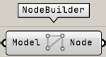
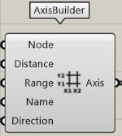

Categories of components that create information for STB export

:::note
The usage and notes for this component are also described in [Export ST-Bridge file](../Usage/ExportSTB) for more details.
:::

---

## Frame Builder by angle

Create the frame information from the Karamba3D model.  
To classify columns and beams, enter the angle of the global coordinate with respect to the Z-axis in Angle, and if the angle is within that range, the column is determined to be a column.

| Input |                           description                           |
| ----- | :-------------------------------------------------------------: |
| Model |               Input the Model output of Karamba3D               |
| Angle | Angle (rad) to be used when determining between column and beam |

| output  |            description            |
| ------- | :-------------------------------: |
| Member  |  Member information (StbMembers)  |
| Section | Section information (StbSections) |

---

## Node Builder

Create the nodal information from the Karamba3D model.

| Input |          Explanation           |
| ----- | :----------------------------: |
| Model | Input Karamba3D's Model output |

| output |         description          |
| ------ | :--------------------------: |
| Node   | Nodal information (StbNodes) |

## Axis Builder

Create the axis information

| Input     |                       Description                        |
| --------- | :------------------------------------------------------: |
| Node      | Nodal information, input the Node output of FrameBuilder |
| Distance  |        distance of the axis from the origin (mm)         |
| Range     |                    width of axis (mm)                    |
| Name      |                       name of axis                       |
| Direction |                  direction of the axis                   |

| Output |         Description         |
| ------ | :-------------------------: |
| Axis   | axis information (StbAxes)} |

---

## Story Builder

Create the floor information

| input  |                       description                        |
| ------ | :------------------------------------------------------: |
| Node   | Nodal information, input the Node output of FrameBuilder |
| Height |         height of the floor from the origin (mm)         |
| Range  |                 width of the floor (mm)                  |
| Name   |                    Name of the floor                     |

| Output |          Description           |
| ------ | :----------------------------: |
| Story  | Story information (StbStories) |
