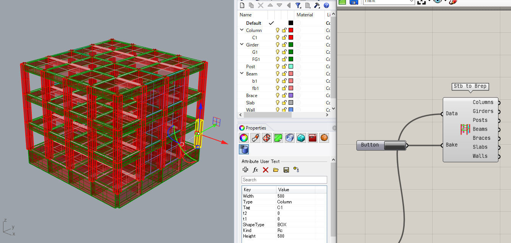

This section explains how to load an STB model into Grasshopper and bake it into Rhino. Please refer to the model in ShowStbModel.gh in the Samples folder.

## Load the STB file

When you open the file, it should look like this: Right click on the path component and select one existing file, then select the stb file you want to visualize.  
If there are no errors in loading, the Load STB data component next to it will convert the data. Connect this output to the visualization components to visualize the information in the Rhino viewport.

## Geometry Bake

The Stb2Brep component and the Stb2Line component have a Bake function.  
The Bake status is as shown in the following image.

Layers are divided into Column, Girder, Post, Beam, Brace, Slab, and Wall, which are further divided into sublayers for each member code.

We add meta information to the baked geometry. When you select the geometry and check the Attribure User Text in the Properties, you can see the section size and other values, which is a BIM-like function.

