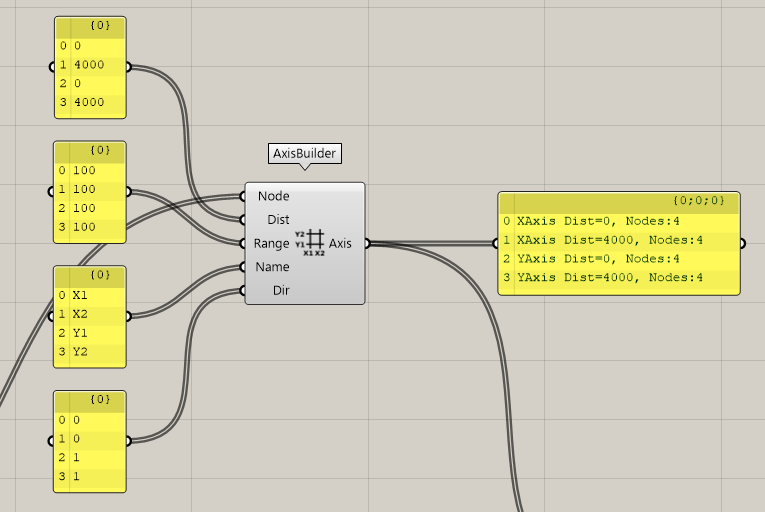

This section explains how to create ST-Bridge data from Karamba3D data. Please refer to the ExportSTB.gh model in the Samples folder for the details.  
The output will be in ST-Bridge version 1.4 format.

## Convert Karamba3D model

From the model created by Karamba3D, the following will be created

- Nodes (StbNodes)
- Part information (StbMembers)
- Section information (StbSections)

The model data output from the AssembleModel component of Karamba3D will be converted by inputting the data into the FrameBuilder by angle component and NodeBuilder as follows.  
The Rhino viewport will display text to indicate whether the converted member is a column, beam, or brace. Columns and beams are classified based on the angle of the member, so if this is not the expected classification, enter the appropriate angle in the Angle input.

:::note
Please see the conversion specification at the bottom of this page for more information on how to model the output from Karamba3D.
:::

## Creating Axis Information

The AxisBuilder component is used to create data for the axes (StbAxes).  
The basic idea of the behavior is that nodes that are within the Range width (Dist ± Range) from the axis specified by Distance are treated as nodes belonging to the axis.  
By looking at the output of the component, you can check the direction of the axis, the distance from the origin, and the number of nodes belonging to the axis.

The specification of the input is as follows. It is not easy to understand, so it will be improved in the future. The input is a list, and inputs with the same index are matched and converted.

- Node: nodal information, please enter the Node from the NodeBuilder output
- Distance: Specify the distance of the axis from the origin.
  - The direction of the axis will be parallel to the X or Y axis of the overall coordinate system.
  - The direction of the axis is parallel to the X-axis or Y-axis of the overall coordinate system. Whether the specified Distance is in the X-direction or Y-direction is specified by the Direction input.
- Range: Specify the width of the nodal point belonging to the axis set in Distance.
  - Due to the fact that nodal coordinates are in floating point format, it is recommended to set a value greater than 0, even if all nodes are on the axis.
- Name: The name of the axis.
- Direction: Specifies the direction of the axis.
  - A value of 0 means that the axis will be treated as X-directed, and a value of 1 means that the axis will be treated as Y-directed.

## Create the floor information

The StoryBuilder component is used to create data for floors (StbStories).  
The basic behavior is the same as the AxisBuilder component.  
By looking at the output of the component, you can check the name of the floor, the height of the floor, and the number of nodes it belongs to.

- Node: Nodal information, enter the Node in the NodeBuilder output.
- Height: Floor height information. Please enter the height from the origin.
- Range: Specify the width of the nodal point for the floor specified by Height.
- Name: This is the name of the floor.

## Output the data

By inputting all the data converted by the above three into the Export STB file component, the data will be combined to create a single ST-Bridge file.  
The STB file will be output to the path specified in Path. If not specified, the file will be output to the desktop as model.stb.  
If you set the value of Out? to True, the file will be output. By checking the output, you can get an overview of the data conversion status.

---

## Conversion specifications

ST-Bridge data is created according to the following specifications.

### Target

- Output in ST-Bridge version 1.4 format.
- Convert columns, beams, and braces, but not surface materials such as floor walls.

:::note
Output in ST-Bridge version 2 format will be supported in the future.
:::

### Part Identification

- The Karamba3D model does not distinguish between column and beam braces, so the following specifications are used
  - If a part is treated as a truss element in Karamba3D, it is converted to a brace.
  - If the angle of a member is less than the angle entered in FrameBuilder's Angle to the Z-axis of the overall coordinate system, the member is considered to be a column; if the angle is greater than the angle, the member is considered to be a beam.
- The identification of the member corresponds to the respective representation in StbMember in ST-Bridge (e.g. StbColumn).
- STB beam members have a flag (isFoundation) to indicate whether the member is a foundation member, but all are output as False.

### Material Identification

- In Karamba3D, if the Family name is "Steel", the material is assumed to be S. If the Family name is "Concrete", the material is assumed to be RC.
- The material identification corresponds to the respective expression in StbSections in ST-Bridge (e.g. StbSecColumn_RC).

:::important
If the family name of the material is other than the above, an error occurs.
:::

### Material name

- Do not use Karamba3D's own names.
- Karamba3D has an internal order of material names, which is a combination of numbers: C for columns, G for beams, V for braces. (C1, G1, etc.)

### Cross Section Name

- Create a cross section with the name set in the Name field of the Cross Section component in Karamba3D.

:::important
Since each name is output to the STB file, please make sure to set the name.  
If there is a duplicate Name, HoaryFox Converter will treat it as the same section, so only one section will be output.
:::

### Cross section shape

- The cross section will be output to STB according to the cross section shape set in Karamba3D.
- If there is an error in the conversion, the cross section will be output as a 10 mm square.
- RC cross-section does not have reinforcement information in Karamba3D, so it will be output as follows
  - Main reinforcement: 3-D22 at top and bottom for beams, 8-D22 for columns
  - Shear reinforcement: 2-D10@100
- For S-section, the material is SN400 for both flange and web.

:::note
If you have any requests for unsupported functions, please contact us.
:::
